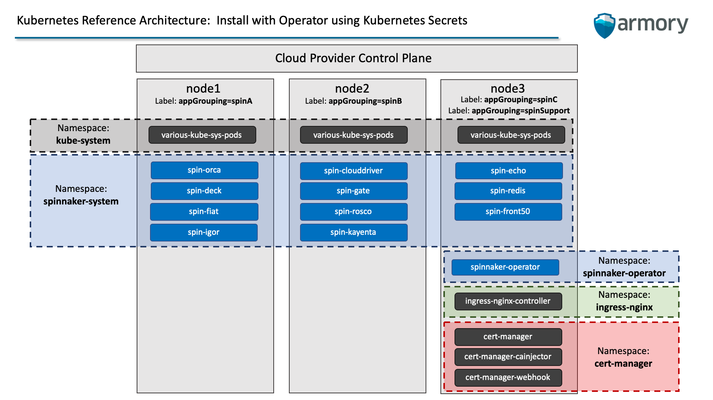

## Spinnaker Self-Service Guide: Install with Operator using Kubernetes Secrets

### Objective

Install Spinnaker using Operator into a Kubernetes Cluster hosted by a Cloud Provider resulting in a system that 
satisfies the following requirements:
1. Spinnaker object storage in AWS S3 Bucket
1. Spinnaker secrets stored in Kubernetes Secrets
1. Spinnaker provider accounts updated manually through Configuration updates
1. Spinnaker UI reachable via Cloud Provider LoadBalancer
    * Nginx Ingress Controller will be leveraged to deliver this requirement
1. Spinnaker UI authentication restricted using SAML
    * Okta will be leveraged to deliver this requirement
1. Spinnaker UI authorizations set by SAML groups
    * Okta Groups: 'spin-admin', 'spin-ops', 'spin-qa', 'spin-dev'
1. Spinnaker UI secured using SSL issued at no-cost by Let's Encrypt
    * Cert-Manager will be leveraged to deliver this requirement
    
### Assumptions

This installation guide assumes the following:
1. You will be using your local machine to communicate with your Kubernetes Cluster using `kubectl` and your
`kubeconfig`
1. You will be using `https://spinnaker.armory.io` as your Spinnaker Deck UI URL
    * You will have the opportunity to customize this to your own domain during the install
1. You will be using `https://api.spinnaker.armory.io` as your Spinnaker Gate API URL
    * You will have the opportunity to customize this to your own domain during the install
    * WARNING:  You'll need to settle on the naming convention for your Gate API URL before setting up Okta SAML

### Prerequisites

This installation guide assumes you have already completed the following:

1. Create a managed Kubernetes (K8s) Cluster at a Cloud Provider with the following specs:
    1. Three nodes each with at least 2 CPUs and 4GiB of RAM
1. Obtain and save locally your `kubeconfig` file from the Cloud Provider Dashboard
1. Install `kubectl` on your local machine
1. Install `kustomize` on your local machine
1. Verify access to your K8s cluster using `kubectl` for your local machine
1. Create AWS S3 Bucket for use as object storage
1. Create AWS IAM Role granting access to the S3 Bucket
1. Create AWS User granted the aforementioned AWS IAM Role
    * NOTE:  Be sure to save the `AWS Access ID` and `AWS Secret Key` when creating the AWS User
1. Register a Domain
1. Obtain access to modify the Domain's DNS
1. Configure Okta Groups
1. Create Okta User
1. Assign new user to Okta Groups
1. Create new Okta Application using Okta's Classic UI
1. Assign User to Okta Application
1. Configure Okta Application for SAML authentication
    * Retrieve the Okta IssuerId you set during the configuration
    * Retrieve the Okta SAML metadata.xml 
1. Create required files to enable SAML authentication
    * metadata.xml
    * samlkeystore.jks (Alias & Password Protected)
---
---

## Resulting Kubernetes Architecture





---
---
## Before You Begin 
#### Part 1: Setup Local Environment, Download Installation Manifests, & Prep Files

```text
cd
```

```text
git clone https://github.com/marqaaron-armory/armory-selfservice-guides
```

```text
mkdir spinnaker
```

```text
mkdir spinnaker/installation
```

```text
cp -r armory-selfservice-guides/installation/operator-using-kubernetes-secrets/* spinnaker/installation
```

```text
cd spinnaker
```

```text
## Copy and paste the contents of your kubeconfig file then save

vim kubeconfig
```

**NOTE:**  For ease of typing and to enable the copying and pasting of this guide, we recommend you create a terminal alias 
so that you can shorten the kubectl commands.  For the purposes of this installation guide, we will create an alias 
`kcspin` that is equivalent to `kubectl --kubeconfig ~/spinnaker/kubeconfig `

```text
cd installation
```

```text
mkdir .secrets
```

```text
## To ensure the commands later in the guide work you'll need a copy of the kubeconfig in the .secrets folder
## You'll also need to move your metadata.xml and samlkeytore.jks files into the .secrets folder as well

cp ../kubeconfig .secrets
```

**NOTE:** Don't forget to move your SAML metadata.xml and samlkeystore.jks files into the .secrets folder!
You'll need these file to be in .secret folder in subsequent steps.

--- 
#### Part 2: Label Your Worker Nodes
In order to best utilize the resources available, these installation manifests make use of the `nodeSelector` property
when defining deployment specs.  In support of this, you must label your three nodes accordingly.  The end result will
be the following:

* Node 1 will have the following label:
    * appGrouping=spinA
* Node 2 will have the following label:
    * appGrouping=spinB
* Node 3 will have the following label:
    * appGrouping=spinSupport

First, look up your node names.
```text
kcspin get nodes
```

You should see an output that looks like this:
```text
NAME                        STATUS   ROLES    AGE   VERSION
lke3584-4752-5e9781517e80   Ready    <none>   18d   v1.17.0
lke3584-4752-5e9781518635   Ready    <none>   18d   v1.17.0
lke3584-4752-5eaf055250c3   Ready    <none>   24h   v1.17.0
```

Next set Environment Variables for each of your Node Names.
```text
NODE_NAME_1=lke3584-4752-5e9781517e80
```

```text
NODE_NAME_2=lke3584-4752-5e9781518635
```

```text
NODE_NAME_3=lke3584-4752-5eaf055250c3
```

Now label each of your nodes.
```text
kcspin label nodes ${NODE_NAME_1} appGrouping=spinA
```

```text
kcspin label nodes ${NODE_NAME_2} appGrouping=spinB
```

```text
kcspin label nodes ${NODE_NAME_3} appGrouping=spinSupport
```

You can verify your nodes are correctly labeled by running the following command:
```text
kcspin get nodes --show-labels
```
[Kubernetes Reference: Assigning Pods to Nodes](https://kubernetes.io/docs/concepts/configuration/assign-pod-node/)

---
---

## Step-by-Step Instructions

#### Step 1: Create Namespaces

We recommend not changing the names of the namespaces for Spinnaker, Spinnaker Operator, or any of the other resources
in these installation manifests.  If you do decide to change the the names, you'll need to check and make updates to the
namespaces declared in the `kustomization.yml` files of each step's directory.  Additionally, you'll have to adjust the
`kubectl create secret` command in Step 2 to the proper namespace.

WARNING:  Spinnaker, NGINX Ingress Controller, and Cert-Manager must be deployed to separate namespaces to avoid potential 
resource limit conflicts.

Again, we strongly recommend not changing the namespace names for ease of installation.

Ensure you're in the installation directory
```text
cd ~/spinnaker/installation
```

```text
kcspin apply -f 01namespaces/
```

---

#### Step 2: Create Spinnaker Secret in Kubernetes

In order to complete this step you'll need 3 files and 4 string literals:

NOTE:  All three files should be located in the installation/.secret directory

* Files
    1. Kubeconfig
    1. metadata.xml
    1. samlkeystore.jks
* String Literals
    1. samlkeystore Alias
    1. samlkeystore Password
    1. Okta IssuerId
    1. AWS Secret Key

Move into the .secret directory
```text
cd .secrets
```
Declare String Literals as Environment Variables (Substitute Your Own Values!)
```text
SAML_KS_ALIAS='samlkeystoreuser'
```
```text
SAML_KS_PASSWORD='keystorepassword'
```
```text
OKTA_ISSUER_ID='io.armory.spinnaker.okta'
```
```text
AWS_SECRET_KEY='asdfgasdfg1234512345'
```
```text
kcspin -n spinnaker-system create secret generic spin-secrets \
--from-literal=samlJksAlias=${SAML_KS_ALIAS} \
--from-literal=samlJksPassword=${SAML_KS_PASSWORD} \
--from-literal=awsSecretAccessKey=${AWS_SECRET_KEY} \
--from-literal=samlIssuerId=${OKTA_ISSUER_ID} \
--from-file=metadata.xml \
--from-file=samlkeystore.jks \
--from-file=kubeconfig
```
Return to installation directory
```text
cd ..
```
[Kubernetes Reference: Secrets](https://kubernetes.io/docs/concepts/configuration/secret/)

---
#### Step 3: Install Spinnaker Operator Custom Resource Definitions (CRDs)
Spinnaker Operator requires both SpinnakerService and SpinnakerAccount CRDs to be installed.  

These manifests must be installed as is and shouldn't be customized.
```text
kcspin apply -f 03spinnakerCrds/
```
[Armory Spinnaker Operator Reference](https://docs.armory.io/operator_reference/operator-config/)

---
#### NOTE: Kustomize with Kubectl
You can always tell a directory that is `kubectl kustomize` enabled by the presence of a `kustomization.yml` file. In 
these directories you will also see `base-example.yml` files and `patch-example.yml` files.  When `kubectl kustomize`
is invoked the patch files are strategically merged into the base files in the order they are listed in the `kustomization.yml`
file.  We have setup many of our `kubectl kustomize` enabled directories with patch files that already contain common points
of customization. While in most cases patch files are used for customizations, occasionally customizations are handled
through the `kustomization.yml` file itself for a more controllable implementation.  

For testing purposes you can conduct a dry run on any of the step directories by running the following command structure:
```text
kubectl kustomize <<directory-name>>
```

To deploy the manifests into your cluster you will use the following command structure:
```text
kubectl apply -k <<directory-name>>
```

[Kustomize with Kubectl Reference Documents](https://kubectl.docs.kubernetes.io/pages/app_management/introduction.html).

---
#### Step 4: Deploy Spinnaker Operator
These manifests deploy Spinnaker Operator which is the tool used to deploy Spinnaker "the Kubernetes Way". The deployment
consists of two containers: the Operator and Halyard.

Customized through `kustomization.yml`
* Armory Operator Image Tag
* Armory Halyard Image Tag

Note: Use the above to modify the image versions to the desired compatibility.

Customized through `patch-` files:
* Spinnaker Operator Deployment replicas

```text
kcspin apply -k 04deployOperator/
```
[Armory Spinnaker Operator Reference](https://docs.armory.io/operator_reference/operator-config/)

---
#### NOTE: Kustomize with Spinnaker Operator SpinnakerService manifest
The Kustomize approach used to strategically patch the SpinnakerService files is different than the `kubectl kustomize`
used above and as such the command structure used to compile the patched manifest is different.

WARNING:  The Deploy Spinnaker directory is the ONLY directory that uses this approach.

For testing purposes you can conduct a dry run on using the following command structure:
```text
kustomize build <<directory-name>>
```

To deploy the manifests into your cluster you will use the following command structure:
```text
kustomize build <<directory-name>> | kubectl deploy -f -
```

Verify that the manifests have stabilized and that both containers in the Spinnaker Operator Pod are Running and Ready.
```text
kcspin get pods -A
```

[Kustomize Reference Documents](https://github.com/kubernetes-sigs/kustomize)

---
#### Step 5: Deploy Spinnaker
The patch files included are configured to meet the requirements outlined above, but require a few modifications.

In the `patch-config.yml` file modify the following properties:

* spec.spinnakerConfig.version
    * NOTE:  Be sure that the version to be deployed is compatible with the Operator and Halyard versions deployed.

* spec.spinnakerConfig.config.persistentStorage.s3.bucket
* spec.spinnakerConfig.config.persistentStorage.s3.region
* spec.spinnakerConfig.config.persistentStorage.s3.accessKeyId

* spec.spinnakerConfig.config.security.apiSecurity.overrideBaseUrl
    * This is your `Spinnaker Gate API URL`
* spec.spinnakerConfig.config.security.uiSecurity.overrideBaseUrl
    * This is your `Spinnaker Deck UI URL`
* spec.spinnakerConfig.config.security.authn.saml.serviceAddress
    * NOTE:  apiSecurity.overrideBaseUrl and authn.saml.serviceAddress must be the same Fully Qualified Domain Name

Any further customizations you wish to make to your Spinnaker System will be accomplished by modifying these patch 
files. For the purposes of this installation guide, no additional changes are necessary.

Now install Spinnaker.

```text
kustomize build 05deploySpinnaker/ | kcspin apply -f -
```

Verify that the manifests have stabilized and that all Spinnaker Pods are Running and Ready.
```text
kcspin get pods -A
```

[Armory Spinnaker Operator Reference](https://docs.armory.io/operator_reference/operator-config/)

[OSS Spinnaker Halyard Reference](https://www.spinnaker.io/reference/halyard/)

---
#### Step 6: Install Nginx Ingress Controller Resources & Deploy LoadBalancer
These files are setup just a little differently than the other `kustomization` enabled directories.  The `kustomization.yml`
file contains file references for 6 different LoadBalancer deployments. These files cover the following Cloud Providers:
* Amazon Web Services (AWS)
* Google Cloud Platform (GCP)
* Microsoft Azure
* Digital Ocean
* Linode

Simply review the `kustomization.yml` file and uncomment the base file references and the patch file references for 
your desired Cloud Provider LoadBalancer.

WARNING: Be sure to read the comments in the `kustomization.yml` file as it makes reference to the available Deployment
image tags.  To find the latest release of the Nginx Ingress Controller check out the [Releases](https://github.com/kubernetes/ingress-nginx/releases).

Customized through `kustomization.yml` file:
* Nginx Ingress Controller Image Tag
    * You can use this Image Tag property to update the Nginx Ingress Controller in the future

Customized through `patch-` files:
* Ingress-Nginx-Controller Deployment
    * Node Selector
* Linode LoadBalancer
    * Service Annotations to configure LoadBalancer
    * Service Session Affinity

```text
kcspin apply -k 06nginxIngressController/
```
[Nginx Ingress Controller Reference](https://kubernetes.github.io/ingress-nginx/deploy/)

--- 
#### Step 7:  Update DNS Records
Obtain the External-IP Address of your Nginx Ingress Service.

```text
kcspin get services -A
```

You should see an output that looks similar to the following:
```text
NAMESPACE            NAME                         TYPE           CLUSTER-IP       EXTERNAL-IP    PORT(S)                      AGE
default              kubernetes                   ClusterIP      10.128.0.1       <none>         443/TCP                      1d
kube-system          kube-dns                     ClusterIP      10.128.0.10      <none>         53/UDP,53/TCP,9153/TCP       1d
ingress-nginx        ingress-nginx-controller     LoadBalancer   10.128.181.224   45.80.50.111   80:30812/TCP,443:31678/TCP   1m
```

Use the External-IP of the `ingress-nginx-controller` service to create A records for you Spinnaker Gate and Spinnaker Deck URLs.

---
#### Step 8:  Install Cert-Manager Resources
Cert Manager requires its Custom Resource Definitions to be installed.  

These manifests must be installed as is and shouldn't be customized.
```text
kcspin apply -k 08certmanagerResources/
```

Prior to moving forward, verify that all the three pods deployed by these manifests are running and ready using the following:
```text
kcspin get pods -n cert-manager
```

You should see an output that looks like the following:
```text
NAME                                       READY   STATUS    RESTARTS   AGE
cert-manager-579d48dff8-jmpgb              1/1     Running   0          1m
cert-manager-cainjector-789955d9b7-g2rlv   1/1     Running   0          1m
cert-manager-webhook-64869c4997-vnzrb      1/1     Running   0          1m
```
[Cert-manager Installation Reference](https://cert-manager.io/docs/installation/kubernetes/)

---
#### Step 9: Deploy Cert-Manager Cluster Issuers
Cert Manager requires two Cluster Issuers that are used to validate and retrieve SSL from Let's Encrypt.  The Prod 
Cluster Issuer should be used only to retrieve real SSL.  The Staging Cluster Issuer can be used for testing as it is not
rate limited by Let's Encrypt.

Customized through `patch-` files:
* Email Address used with Prod Cluster Issuer
* Email Address used with Staging Cluster Issuer

NOTE: You must change these email addresses

```text
kcspin apply -k 09certmanagerClusterIssuers/
```
[Cert-manager Issuer Reference](https://cert-manager.io/docs/configuration/acme/http01/#configuring-http01-ingress-provider)

NOTE:  Cert-manager doesn't have a specific document for Cluster Issuers so use the Issuer reference if needed.  The
difference between them is a Cluster Issuer is cluster wide whereas an Issuer is namespace specific.

---
#### Step 10: Deploy SSL-enabled Spinnaker Ingresses for Deck and Gate
In order to secure communications to the Spinnaker System, deploy SSL-enabled Nginx Ingresses for both Spinnaker Deck 
and Spinnaker Gate.  These manifests will initiate an SSL Certificate Issue request to Let's Encrypt that could take a
minute or two to complete.

In the `patch-ingress-deck.yml` file customize the following properties:
* spec.rules.host
* spec.tls.hosts

In the `patch-ingress-gate.yml` file customize the following properties:
* spec.rules.host
* spec.tls.hosts

```text
kcspin apply -k 10deploySpinnakerIngresses/
````

Verify the Certificate Issuance completed successfully by running the following command:

```text
kcspin get certificates -A --watch
```
NOTE: You can terminate the `kubectl get --watch` by pressing `ctl-c`.

Once the Certificates are successfully issued, you should see an output that looks like this:
```text
NAMESPACE          NAME                               READY   SECRET                             AGE
spinnaker-system   spinnaker-deck-nginx-ingress-tls   True    spinnaker-deck-nginx-ingress-tls   1m
spinnaker-system   spinnaker-gate-nginx-ingress-tls   True    spinnaker-gate-nginx-ingress-tls   1m
```


[Cert-manager Ingress Resource Reference](https://cert-manager.io/docs/usage/ingress/)

---
#### Step 11: Navigate to your Spinnaker Deck URL
You should now be able to navigate to your Spinnaker System via HTTPS at your Spinnaker Deck UI URL.  Spinnaker will see
that you're unauthenticated and forward your to Okta for login.

---
#### Step 12: Wrapping up
Now that your system is installed; create a new directory for your Spinnaker Configuration files that you can use for
further customizations.

```text
cd ..
```

```text
mkdir configuration
```

```text
cp -r installation/05deploySpinnaker/* configuration
```
